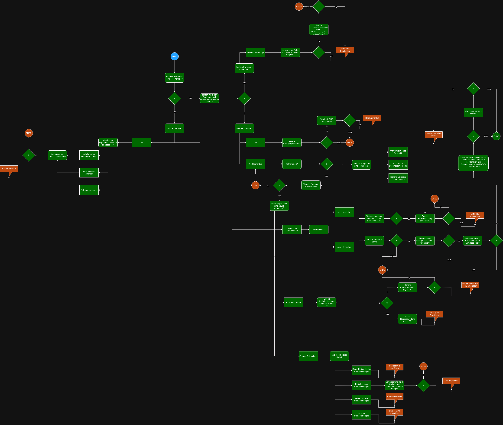

# Praktikum Informationsmanagement Sommersemester 2024

Dieses Repository setzt einen Teil der Leitline _S2k-Leitlinie Parkinson-Krankheit_ Version 8.1 [(https://register.awmf.org/de/leitlinien/detail/030-010)](https://register.awmf.org/de/leitlinien/detail/030-010) als Algorithmus um.

Der Algorithmus kann in der [drawIO-XML](https://github.com/diemeise/pim_decision_support/blob/main/DecisionTreePIM.drawio-3.xml) eingesehen werden.
Aus diesem Algorithmus wurden Fragebogen erstellt, mit dessen Antworten Empfehlungen für weitere Therapieschritte ausgegeben werden können.

Durch das Öffnen der index.html-Datei in einem Browser können die Fragen beantwortet und eine Empfehlung angefordert werden. Es ist keine weitere Installation oder Konfiguration notwendig.

Für das Testen und Debuggen kann in der index.html-Datei die Zeile 423 auskommentiert werden.
Dadurch werden weitere Funktionen und Inputelemente freigeschaltet.

Testcases können in der Datei testing/testcases.js nach dem vorhandenen Schema hinzugefügt oder verändert werden.

##
__Die hier dargestellten Inhalte dienen ausschließlich der neutralen Information und allgemeinen Weiterbildung. Sie stellen keine Empfehlung oder Bewerbung der beschriebenen oder erwähnten diagnostischen Methoden, Behandlungen oder Arzneimittel dar. Die Inhalte erheben weder einen Anspruch auf Vollständigkeit noch kann die Aktualität, Richtigkeit und Ausgewogenheit der dargebotenen Information garantiert werden. Die Inhalte ersetzen keinesfalls die fachliche Beratung durch eine\*n Arzt\*Ärztin oder Apotheker\*in und er darf nicht als Grundlage zur eigenständigen Diagnose und Beginn, Änderung oder Beendigung einer Behandlung von Krankheiten verwendet werden. Konsultieren Sie bei gesundheitlichen Fragen oder Beschwerden immer eine\*n Arzt\*Ärztin!__